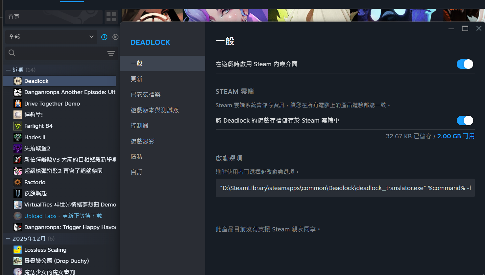

# Deadlock 繁體中文翻譯自動更新工具

一個自動從論壇下載 Deadlock 遊戲繁體中文翻譯檔案、替換本地檔案並啟動遊戲的工具。

## 功能

- ✅ 自動從論壇頁面抓取 Google Drive 下載連結
- ✅ 自動驗證下載完整性
- ✅ 複製翻譯檔案到遊戲目錄
- ✅ 下載完成後自動啟動遊戲

## 快速開始

### 下載並執行 exe

#### 步驟 1：下載
前往 [Releases](../../releases) 下載最新的 `deadlock_translator.exe`。

#### 步驟 2：放置檔案
將 exe 放在 Deadlock 遊戲根目錄。

#### 步驟 3：執行程式
雙擊執行 `deadlock_translator.exe`

#### 步驟 4：配置啟動選項
程式執行完成後，請按照程式指示：
1. 複製程式提供的啟動選項內容
2. 在 Steam 中進入 Deadlock 屬性
3. 找到「啟動選項」欄位
4. 貼上程式提供的內容

5. 保存設定

#### 步驟 5：配置啟動選項
未來只需要從Steam啟動即可自動更新翻譯

#### 額外參數配置
如果您需要添加額外的啟動參數，可以在程式提供的內容後面直接追加：
```
程式提供的內容 + 您的自訂參數
```

#### 卸載/停用
如果您不想繼續使用此工具，只需清空 Steam 中 Deadlock 的啟動選項即可。無需刪除 exe 檔案。

## 常見問題

### Q: 程式找不到遊戲路徑

A: 程式使用當前目錄作為遊戲安裝目錄。請確保在 Deadlock 遊戲根目錄執行此程式。

### Q: 下載失敗

A: 
- 檢查網路連線
- 查看 `deadlock_translator.log` 檔案中的詳細錯誤訊息

### Q: 檔案替換失敗

A:
- 確保遊戲未執行
- 檢查是否具有遊戲目錄的寫入權限

## 架構設計

### 工作流程

```
1. 下載論壇頁面
   ↓
2. 解析 HTML 並提取 Google Drive 連結
   ↓
3. 解碼 Gamer 轉址的 URL 參數
   ↓
4. 從 Google Drive URL 提取文件 ID
   ↓
5. 驗證下載檔案的完整性
   ↓
6. 解壓翻譯檔案並複製到遊戲目錄
   ↓
7. 修改 gameinfo.gi 以啟用繁體中文
   ↓
8. 啟動 Deadlock 遊戲
```

## 開發者指南

### 系統需求

- Python 3.8+
- pip (Python 包管理工具)

### 環境設置

#### 1. 建構虛擬環境

在專案根目錄執行以下命令建立虛擬環境：

**PowerShell:**
```powershell
python -m venv venv
.\venv\Scripts\Activate.ps1
```

**Command Prompt (cmd):**
```cmd
python -m venv venv
.\venv\Scripts\activate.bat
```

**Bash (Git Bash 或 WSL):**
```bash
python -m venv venv
source venv/Scripts/activate
```

虛擬環境啟動後，命令列會顯示 `(venv)` 前綴。

#### 2. 安裝依賴
```bash
pip install -r requirements.txt
```

#### 3. 構建 exe
```bash
python build.py
```

生成的 `deadlock_translator.exe` 會在 `dist/` 資料夾中。

### 專案結構

```
deadlock-tw-update/
├── main.py                    # 主程式入口
├── translator.py              # 核心邏輯 (下載、替換、啟動)
├── requirements.txt          # Python 依賴
├── build.py                  # exe 構建工具
├── README.md                 # 此檔案
└── .github/
    └── copilot-instructions.md
```

## 主要類別

### `TranslationManager`

負責所有翻譯相關操作：

```python
from translator import TranslationManager

manager = TranslationManager()

# 下載翻譯
path = manager.download_translation()

# 替換檔案
manager.replace_translation_files(path)

# 啟動遊戲
manager.launch_game()
```

### 自訂化修改

#### 修改翻譯檔案位置

在 `translator.py` 的 `replace_translation_files()` 方法中修改複製的資料夾列表。

#### 修改下載源

在 `translator.py` 的 `__init__` 方法中修改 `forum_url` 變數的值。

#### 添加代理支援

在 `translator.py` 的 `download_translation()` 中修改：

```python
response = requests.get(
    self.forum_url,
    timeout=self.download_timeout,
    proxies={'http': 'http://proxy:port', 'https': 'https://proxy:port'}
)
```

## 日誌和除錯

### 查看日誌

程式運行後會產生 `deadlock_translator.log` 檔案：

```bash
# 追蹤日誌
tail -f deadlock_translator.log
```

### 修改日誌級別

在 `translator.py` 的 `__init__` 方法中修改 `log_level` 變數的值為 `"DEBUG"`, `"INFO"`, `"WARNING"` 或 `"ERROR"`。

### 測試下載功能

```python
from translator import TranslationManager

manager = TranslationManager()
path = manager.download_translation()
print(f"下載路徑: {path}")
```

## 開發者常見問題

### Q: 構建 exe 失敗

A:
- 確認已在虛擬環境中安裝依賴：`pip install -r requirements.txt`
- 確認 PyInstaller 已安裝：`pip install pyinstaller`

## 資安注意事項

- ⚠️ 請在安裝翻譯前備份重要檔案
- ✅ 定期檢查 `deadlock_translator.log` 以監控操作
- ✅ 只從可信任的論壇下載翻譯

## 版本歷史

### v1.0.0 (當前版本)
- 自動下載翻譯
- 自動替換檔案
- 自動啟動遊戲
- exe 構建支援
- 論壇頁面自動解析
- Gamer 轉址支援
- URL 解碼和文件 ID 提取

## 授權

MIT License
